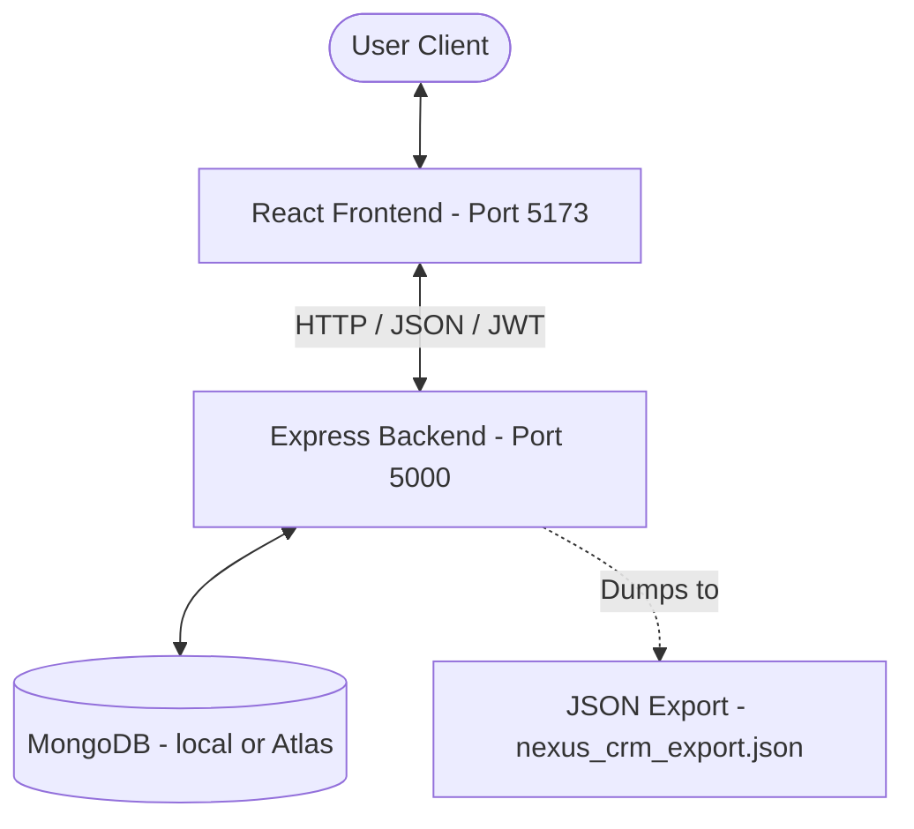

# CRM System - Customer Relationship Management System

CRM System is a modern, responsive Customer Relationship Management web application built with a premium green-themed design system. It allows companies and sales teams to manage customer profiles, track leads throughout their lifecycle (New, Contacted, Converted), and view pipeline analytics through an interactive dashboard.

---

## 🌟 Key Features

1. **User Authentication (Module 1)**:
   - Secured User Registration and Login.
   - Session retention via JWT tokens saved in local storage.
   - Form validations (email format, minimum password length).
   - Safe logout mechanism.

2. **Customer Management (Module 2)**:
   - Create, read, edit, and delete customer profiles.
   - Capture critical details: Name, Email, Phone, Company, Deal Value, and Notes.

3. **Search & Filter (Module 3)**:
   - Real-time instant search by Name, Email, or Company.
   - Filter customer lists by lead status: **New**, **Contacted**, or **Converted**.

4. **Lead Management (Module 4)**:
   - Tracking states: **New**, **Contacted**, and **Converted**.
   - Quick-action dropdown from the table to transition lead status in real time.

5. **Interactive Dashboard (Module 5)**:
   - Metric cards showing counts for Total Customers, New Leads, Contacted Leads, and Converted Leads.
   - Pipeline trends visualized using a smooth emerald Area Chart (powered by **Recharts**).
   - **Lead Status Updates**: A timeline log of recent customer updates in the side panel.

---

## 🛠️ Tech Stack

- **Frontend**: React.js, Vite, Vanilla CSS, Lucide React (Icons), Recharts (Visualizations)
- **Backend**: Node.js, Express.js, JWT, BcryptJS, Morgan (Logger)
- **Database**: MongoDB (via Mongoose ODM)

---


## 🚀 Installation & Setup

Follow these steps to run the application locally:

### 1. Prerequisites
Ensure you have the following installed:
- [Node.js](https://nodejs.org/) (v16 or higher)
- [MongoDB](https://www.mongodb.com/try/download/community) (either running locally or a MongoDB Atlas Cloud URL)

### 2. Install Dependencies
In the root directory of the project, run:
```bash
npm run setup
```
*This script will concurrently install all packages in the root directory, `/backend`, and `/frontend`.*

### 3. Configure Environment Variables
Create a `.env` file inside the `backend/` folder (a default template has already been created for you).
Ensure the variables are configured:
```env
PORT=5000
JWT_SECRET=super_secret_crm_key
MONGO_URI=mongodb://127.0.0.1:27017/crm_system
```
> [!TIP]
> If you do not have MongoDB running locally, you can paste a **MongoDB Atlas Cloud URI** (e.g., `mongodb+srv://<username>:<password>@cluster.mongodb.net/crm_system`) into the `MONGO_URI` field!

### 4. Run the Application
Start both the backend server and Vite frontend concurrently by running:
```bash
npm run dev
```
- The backend will start on: [http://localhost:5000](http://localhost:5000)
- The frontend client will run on: [http://localhost:5173](http://localhost:5173)

Open your browser to [http://localhost:5173](http://localhost:5173) to view the application.

---

## 💾 Database Export File

To satisfy submission requirements, a database export tool is included.

Run the export script from the root directory:
```bash
npm run export-db
```
This script connects to your active database and generates two files in the project root:
1. `crm_system_export.json`: A standard JSON array of all collections.
2. `crm_system_export.sql`: A MySQL-compatible SQL script detailing database tables structure and data inserts (ideal for SQL-based evaluation).

---

## 📁 Directory Structure

```text
CRM-System/
├── package.json               # Root scripts & Concurrent runner configurations
├── README.md                  # Documentation
├── crm_system_export.json      # Generated Database JSON export
├── crm_system_export.sql       # Generated Database SQL export
├── backend/
│   ├── package.json           # Backend dependencies
│   ├── .env                   # DB credentials & JWT secret keys
│   ├── server.js              # Express entry point
│   ├── db.js                  # Database connection setup
│   ├── models/                # Mongoose database models (User, Customer)
│   ├── middleware/            # Protect route authentication middlewares
│   ├── routes/                # Route handlers (auth, customers, dashboard)
│   └── scripts/               # DB Dump and SQL generation scripts
└── frontend/
    ├── package.json           # Frontend dependencies (lucide, recharts)
    ├── vite.config.js         # API Server Proxy configurations
    ├── index.html             # Entry HTML document (with SEO Meta)
    └── src/
        ├── main.jsx           # Vite startup script
        ├── App.jsx            # Layout route declarations
        ├── index.css          # Green-themed responsive CSS design system
        ├── context/           # AuthContext managing user sessions
        ├── components/        # ProtectRoute wrappers
        └── pages/             # LandingPage, LoginPage, RegisterPage, Dashboard
```
