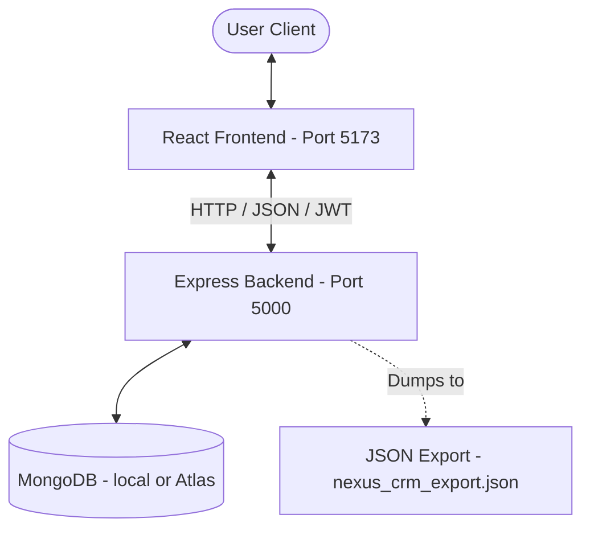

# Implementation Plan - CRM System

CRM is a Customer Relationship Management (CRM) web application designed with a premium, green-themed modern UI/UX based on the provided wireframes. It includes full authentication, customer profiles, lead status tracking, search/filtering, and an interactive dashboard.

## User Review Required

> [!IMPORTANT]
> **Database Selection (Updated)**: As requested, we will use **MongoDB** as the database with **Mongoose** as the ODM. By default, the app will try to connect to a local instance at `mongodb://127.0.0.1:27017/crm`, but this can be adjusted in the backend's `.env` file.
>
> **Database Export File**: We will include a script (`npm run export-db`) in the backend to export all collections (Users, Customers) as JSON arrays in a readable `nexus_crm_export.json` file in the project root. This file can be easily shared or imported back.

> [!TIP]
> **Component Library**: We will use **Lucide React** for clean and modern outline icons, and **Recharts** for beautiful charts on the dashboard. Both are industry standards and look extremely premium.

---

## Proposed Architecture

We will set up a monorepo structure with a backend and frontend:
1. `backend/`: Node.js + Express.js + MongoDB (Mongoose).
2. `frontend/`: React + Vite + CSS.
3. Root `package.json` with `concurrently` to run both services with a single command (`npm run dev`).

---

## Proposed Changes

### 1. Project Configuration & Root Setup

#### [NEW] [package.json](file:///c:/Users/palla/Desktop/Projects/CRM-System/package.json)
Configure root commands to run frontend and backend simultaneously, run initial installation scripts, and manage exports.
- **Dependencies**: `concurrently` (devDependency).
- **Scripts**:
  - `"install-all"`: Installs dependencies for root, backend, and frontend.
  - `"dev"`: Runs backend and frontend in parallel.
  - `"export-db"`: Runs the database export script.

#### [NEW] [README.md](file:///c:/Users/palla/Desktop/Projects/CRM-System/README.md)
Detailed documentation with installation guide, MongoDB setup instructions, database export instructions, feature breakdown, and tech stack information.

---

### 2. Backend Component (`backend/`)

The backend will handle user accounts, authentication tokens, customer records, and dashboard metrics using MongoDB.

#### [NEW] [backend/package.json](file:///c:/Users/palla/Desktop/Projects/CRM-System/backend/package.json)
- **Dependencies**: `express`, `cors`, `mongoose`, `bcryptjs`, `jsonwebtoken`, `dotenv`, `morgan`.

#### [NEW] [backend/.env](file:///c:/Users/palla/Desktop/Projects/CRM-System/backend/.env)
Environment variables: `PORT=5000`, `JWT_SECRET=super_secret_nexus_key`, `MONGO_URI=mongodb://127.0.0.1:27017/nexus_crm`.

#### [NEW] [backend/db.js](file:///c:/Users/palla/Desktop/Projects/CRM-System/backend/db.js)
Establish connection to MongoDB using Mongoose.

#### [NEW] [backend/models/User.js](file:///c:/Users/palla/Desktop/Projects/CRM-System/backend/models/User.js)
Mongoose schema for users: name, email (unique, index), password, timestamps.

#### [NEW] [backend/models/Customer.js](file:///c:/Users/palla/Desktop/Projects/CRM-System/backend/models/Customer.js)
Mongoose schema for customers:
- `userId` (ObjectId, ref: 'User')
- `name` (string, index)
- `email` (string, index)
- `phone` (string)
- `company` (string, index)
- `status` (string: 'New', 'Contacted', 'Converted')
- `value` (number)
- `notes` (string)
- `timestamps` (createdAt, updatedAt)

#### [NEW] [backend/middleware/auth.js](file:///c:/Users/palla/Desktop/Projects/CRM-System/backend/middleware/auth.js)
JWT Authentication middleware to protect routes.

#### [NEW] [backend/routes/auth.js](file:///c:/Users/palla/Desktop/Projects/CRM-System/backend/routes/auth.js)
Routes for authentication:
- `POST /api/auth/register` (hashing, email uniqueness validation, password validation).
- `POST /api/auth/login` (validation, token creation).
- `GET /api/auth/me` (fetching current user profile).

#### [NEW] [backend/routes/customers.js](file:///c:/Users/palla/Desktop/Projects/CRM-System/backend/routes/customers.js)
Protected CRUD routes for customers:
- `POST /api/customers` (create)
- `GET /api/customers` (list with text search by Name/Email/Company, and status filter)
- `GET /api/customers/:id` (detail)
- `PUT /api/customers/:id` (update)
- `PATCH /api/customers/:id/status` (quick status transition)
- `DELETE /api/customers/:id` (delete)

#### [NEW] [backend/routes/dashboard.js](file:///c:/Users/palla/Desktop/Projects/CRM-System/backend/routes/dashboard.js)
Protected routes for dashboard metrics:
- `GET /api/dashboard/stats`: Returns customer counts by status (Total, New, Contacted, Converted) and monthly customer signup timeline for Recharts visual graphs.

#### [NEW] [backend/scripts/export_db.js](file:///c:/Users/palla/Desktop/Projects/CRM-System/backend/scripts/export_db.js)
Script to fetch all Users and Customers from MongoDB and write them to `nexus_crm_export.json` in the project root.

#### [NEW] [backend/server.js](file:///c:/Users/palla/Desktop/Projects/CRM-System/backend/server.js)
Express server entry point.

---

### 3. Frontend Component (`frontend/`)

React client designed to match the provided screens. We'll use custom CSS loaded in `index.css` for the green-themed UI (emerald/forest green, clean cards, hover animations, sidebar, and layout).

#### [NEW] [frontend/src/index.css](file:///c:/Users/palla/Desktop/Projects/CRM-System/frontend/src/index.css)
Global styling sheet defining the design system:
- **Colors**:
  - `--brand-primary`: `#00a859` (emerald green)
  - `--brand-dark`: `#0c4b2b` (forest green sidebar)
  - `--brand-light`: `#f0fbf5` (light pastel green background tint)
  - `--bg-primary`: `#f8fafc` (sleek workspace gray)
  - `--text-dark`: `#1e293b`
  - `--text-muted`: `#64748b`
- **Typography**: Inter / Outfit fonts loaded from Google Fonts.
- **Glassmorphism / Shadow utilities**: Sleek transitions and cards.

#### [NEW] [frontend/src/context/AuthContext.jsx](file:///c:/Users/palla/Desktop/Projects/CRM-System/frontend/src/context/AuthContext.jsx)
React Context providing authentication state (`user`, `token`, `isAuthenticated`, `loading`). Handles token storage, automatic page refresh check, registration, login, and logout.

#### [NEW] [frontend/src/components/ProtectedRoute.jsx](file:///c:/Users/palla/Desktop/Projects/CRM-System/frontend/src/components/ProtectedRoute.jsx)
Wrapper component to redirect unauthorized users to the Landing Page or Login page.

#### [NEW] [frontend/src/pages/LandingPage.jsx](file:///c:/Users/palla/Desktop/Projects/CRM-System/frontend/src/pages/LandingPage.jsx)
Renders Screen 1 (NexusCRM landing page).
- Header with links and Green "Login" button.
- Vibrant Green Hero Section: "Manage Your Customer Relationships Like Never Before", "Get Started Free" button.
- "Everything you need to grow" Feature Cards (Contact Management, Sales Pipeline, Analytics, Team Collaboration).
- Testimonial cards.
- Forest Green Footer.

#### [NEW] [frontend/src/pages/LoginPage.jsx](file:///c:/Users/palla/Desktop/Projects/CRM-System/frontend/src/pages/LoginPage.jsx)
Renders Screen 2.
- Split screen: Left is deep green panel with text "Welcome back - your pipeline awaits..."; Right is a clean form card with email and password inputs, "Login" button, and Register redirection link.

#### [NEW] [frontend/src/pages/RegisterPage.jsx](file:///c:/Users/palla/Desktop/Projects/CRM-System/frontend/src/pages/RegisterPage.jsx)
Renders Screen 3.
- Centered signup form card: "Create Your Account" (Full Name, Email, Password, Confirm Password, Terms Agreement checkbox).

#### [NEW] [frontend/src/pages/Dashboard.jsx](file:///c:/Users/palla/Desktop/Projects/CRM-System/frontend/src/pages/Dashboard.jsx)
Renders Screen 4. Main workspace with:
- **Left Sidebar**: Logo "NexusCRM", navigation menu (Dashboard, Customers, Leads).
- **Top Header**: Search input, user greeting ("Good morning, {name}"), and "+ Add Customer" button.
- **Stats Row**: Four metric cards displaying Total Customers, New Leads, Contacted Leads, and Converted Leads.
- **Main Layout**:
  - Left panel: Search filter options and Customer Table (with status badges, Quick Status dropdown, and Edit/Delete buttons).
  - Right panel: Recent activity feed showing log of recent lead updates.
- **Modals**:
  - Add/Edit Customer Modal.
  - View Customer Details Modal.

---

## Verification Plan

### Automated Tests
We will verify API health and routes using test scripts:
- Verify that server starts and connects to MongoDB.
- Write a backend test script `backend/tests/api.test.js` to programmatically test Register, Login, Create Customer, Search/Filter, and Stats API endpoints (mocking or using a test database).

### Manual Verification
1. Open the landing page, verify links, navigation to Login/Register.
2. Sign up with a new account (verifying validation for passwords and empty fields).
3. Log in, check that JWT is stored, page redirects to Dashboard.
4. Verify Dashboard displays empty state (0 counts).
5. Click "+ Add Customer" and create several customers with various statuses (New, Contacted, Converted).
6. Verify Dashboard stats dynamically update.
7. Search by name/email/company and filter by status tabs to check query performance.
8. Edit customer details and update lead status, validating changes on table and stats.
9. Delete a customer and see metrics adapt.
10. Trigger `npm run export-db` and verify `nexus_crm_export.json` is generated with collection documents.
11. Refresh page and verify session persists. Log out and confirm redirect.
